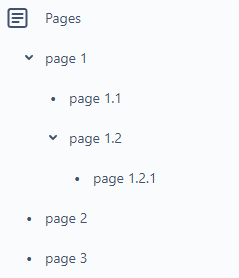

# MarkdownToConfluence
Bachelor 2022 - Anders Larsen &amp; Theis Tengs

This action converts your markdown files into the specified Atlassian Confluence space.

# Setup
## API User Token
First you need to create an API token for the user, you want to use for the action. We recommend that you create a new user, that is only used for this action, in order to get the full benefits from the action. This user should also have full permission to make changes on the space. See [here](https://support.atlassian.com/atlassian-account/docs/manage-api-tokens-for-your-atlassian-account/) for how to set up your API token.

## Inputs

`fileslocation`

**Required** 

The path from the root of your repository, to the folder containing the markdown documentation. Default `./`.

`should_upload`

**Required** 

A boolean value determining whether the action if run on a push event should upload. 

`confluence_url`

**Required** 

The base URL for the Atlassian network. Follows the form: 'https://[your-network-name].atlassian.net'

`confluence_space_key`

**Required**

The key of the space that is being uploaded to. Can be found in the URL for your space. More info [here](https://confluence.atlassian.com/doc/space-keys-829076188.html)

`auth_username`

**Required**

The email used for the user connected to the API token. We recommend setting this as a GitHub secret.
        
`auth_api_token`

**Required**

The API token generated for the user. We recommend setting this as a GitHub secret.
## Outputs

### Ikke lige nogle indtil nu

## Example usage

Without github secrets:
```yaml
jobs:
  markdown_to_confluence_job:
    runs-on: ubuntu-latest
    name: Converting Markdown to Confluence
    steps:
      - name: Checkout
        uses: actions/checkout@v3
      - name: Conversion step
        uses: TTengs/MarkdownToConfluence@v2.2.4
        with:
          fileslocation: './documentation'
          should_upload: false
          confluence_url: 'https://network.atlassian.net/wiki'
          confluence_space_key: 'spaceKey'
          auth_username: 'your@email.com'
          auth_api_token: 'PeRsOnalApItOKen'
```

With GitHub secrets
```yaml
jobs:
  markdown_to_confluence_job:
    runs-on: ubuntu-latest
    name: Converting Markdown to Confluence
    steps:
      - name: Checkout
        uses: actions/checkout@v3
      - name: Conversion step
        uses: TTengs/MarkdownToConfluence@2.2.4
        with:
          fileslocation: './documentation'
          should_upload: false
          confluence_url: 'https://network.atlassian.net/wiki'
          confluence_space_key: 'spaceKey'
          auth_username: ${{ secrets.AUTH_USERNAME }}
          auth_api_token: ${{ secrets.AUTH_API_TOKEN }}
```

---

# Writing Documentation

## Page structure
The structure of the markdown files in the filesystem, dictates the structure of the pages on confluence.

All files should be located in a single folder, which is the one specified in [fileslocation](#fileslocation). This folder will not contain any markdown files (if so, they won't be recognized as pages), but only folders, a [prefix](./doc/prefix.md)- and [settings-file](./doc/settings.md). Every subfolder under this folder, will be considered a page, these are referenced later as a "folderpage".

A folderpage can contain other folderpages, as well as markdown files. The file containing the content of the folderpage, __MUST__ be named "index.md". Any other markdown files inside the folderpage, will be considered as a child page.

A child page can also be defined by another folderpage inside a folderpage. This is only recommended, if you need child pages for that folderpage as well. Otherwise, we recommend simply using multiple markdown files.

### Page naming
The name of a folderpage dicates the name of the page in confluence.

Folderpages with multiple markdown files, will contain child pages named after the name of the markdown file.

Any folderpage can contain a [prefix.txt](./doc/prefix.md) file, dictating the prefix for all it's child pages.

### Example
The following filestructure:


Will look like this, once uploaded to Confluence:



## Modules
This tool comes with a number of modules, which add extra markdown syntax, specialized for Confluence and other tools.

- [Jira Tickets](./doc/modules/jira-tickets.md)
- [Attachments](./doc/modules/attachments.md)
- [Mermaid.js](./doc/modules/mermaid.md)
- [Table of Contents](./doc/modules/table-of-contents.md)
- [Trello Boards](./doc/modules/trello-boards.md)
