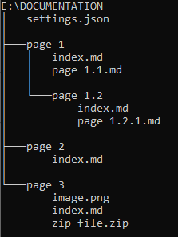

# Attachments and Assets
It is possible to reference a multitude of different types of assets and attachments. 

## File location
The assets and attachments you wish to upload, can be stored anywhere inside of the documentation root folder. When referencing them, you simply specify either the relative path of the markdown file you wish the asset to be linked to, or the absoulute path from the root of the documentation folder (here you have to start the path with the name of the root folder).

### Examples
With the given filestructure:

If you want to incoorporate image.png into "page 3", you simple use the path `./image.png`

But if you want to reference that same image from "page 1", you would write: `documentation/page 3/image.png`, given that "documentation" is the name of the root folder.

You can therefore also create a dedicated attachment folder anywhere in the filesystem, and reference that when you need to attach a file or an image.

## Images
You can insert an image by referencing it using regular markdown syntax:

``

Only images of types .png and .jpg are supported.

## Other attachments
If you want to attach a different filetype, it is also done with regular markdown syntax:

`[alt](filepath "optional title")`

    | Note the missing "!"

These attachments will then be uploaded to the page, and a reference link will be inserted into the page:

