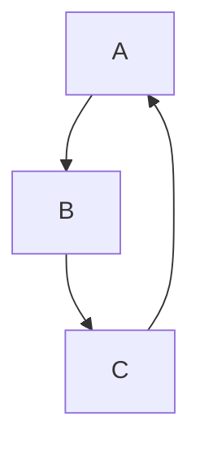

# This is a title

This page showcases what is possible with the MarkdownToConfluence action!

## Tables

| Name     | Address         | Email        | 
|----------|-----------------|--------------|
| John Doe | Street number 5 | John@Doe.com |     
| Jane Doe | Street number 5 | jane@doe.com |

## Images


## Download links

[Download Zip file](./Files.zip)

## Mermaid.js graphs



## Jira tickets and issues

BAC-77

## Table of contents

```TOC
root=DAM Center 5
start-depth=3
```

## Code blocks

```javascript
let hello = "Hello World"
console.log(hello)
```

## Trello boards

https://trello.com/b/199TqwVE/project-guide

