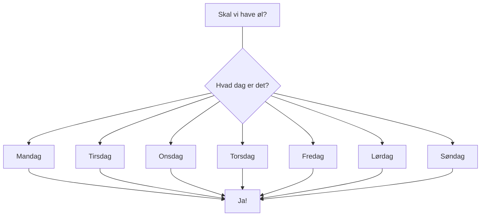

# this is a page 1

```mermaid
	graph TD
      A[Skal vi have øl?] --- B{Hvad dag er det?}
      B-->C[Mandag]
      B-->D[Tirsdag]
	  B-->E[Onsdag]
	  B-->F[Torsdag]
	  B-->G[Fredag]
	  B-->H[Lørdag]
	  B-->I[Søndag]
	  C-->J[Ja!]
	  D-->J[Ja!]
	  E-->J[Ja!]
	  F-->J[Ja!]
	  G-->J[Ja!]
	  H-->J[Ja!]
	  I-->J[Ja!];
```