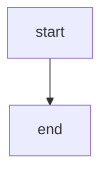

# page 2.1

This is test text

| This | Is   | A   | Test | Table |
|------|------|-----|------|-------|
| test | test |     |      |       |
|      |      | tes | tes  |       |
|      |      |     |      | tes   |

```TOC
```

```javascript
    let test = new Test()
```

https://trello.com/b/hfnwef/dqjqwd



[test](./zip_test.zip)
