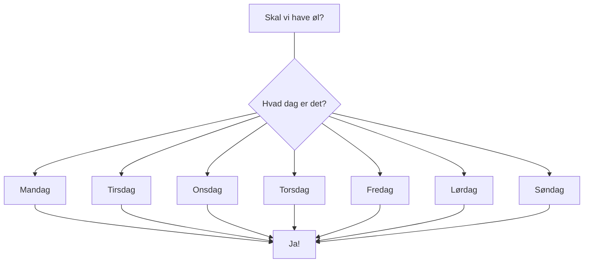

# Header

> paragraph

## Underheader

- list
  - list 2
  - List 3
  - list 4

1. ordered list
1. ordered list 2
1. ordered list 3

yo hvis det her virker så giver jeg en bajer

Din mor for ægte den her gang

|                                                                                                                                                                   Use Case: Bombs                                                                                                                                                                   |
| :-------------------------------------------------------------------------------------------------------------------------------------------------------------------------------------------------------------------------------------------------------------------------------------------------------------------------------------------------: |
|                                                                                                                                                                      ID: U2.1                                                                                                                                                                       |
|                                                                                                                                                                Primary actor: Player                                                                                                                                                                |
|                                                                                                                                                                Secondary actor: None                                                                                                                                                                |
|                                                                                                                                     Short description: The player can place bombs to blow up walls and enemies                                                                                                                                      |
|                                                                                                                                     Pre conditions: The player has to have at least one bomb in their inventory                                                                                                                                     |
| Main flow: 1. The player presses space on the keyboard 2. A bomb is removed from the players inventory 3. A bomb is placed in the world 4. After a delay, the bomb explodes, damaging the surroundings 5. Destructible walls in the blast radius are destroyed (U1.3) 6. Enemies in the blast radius are damaged (U1.3) 7. The bomb cooldown begins |
|                                                                                                   Post conditions: The player has one less bomb in their inventory. Any entities hit by the bomb, are destroyed or damaged, based on what is hit.                                                                                                   |
|                                                                                                                   Alternative flow: The player themself can be hit by the bomb when it explodes (4), and will be damaged as well.                                                                                                                   |



```mermaid
	graph TD
	A --> B
	wejfwe
	ewfmw
	fwe -------------------------------
```

```jira ticket
BAC-18
```
